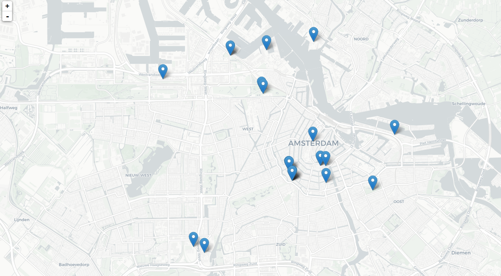

R package and app that got bourne out of the ideas from the "Managing Crowds" hackathon at the Gemeente Amsterdam. This is basically a scraper for events happening around Amsterdam with extended functionality for:

-   scraping of data from various sources ()
-   cleaning up and enrichment of data
-   persistent storage in local database
-   some analysis tools as well as a jab at a predictive model
-   visualisation tools

Sample outputs
--------------

-   Sample [simfuny](http://simfuny.com/) data

<!-- -->

    ## Parsed with column specification:
    ## cols(
    ##   .default = col_character(),
    ##   nid = col_integer(),
    ##   lat = col_double(),
    ##   long = col_double(),
    ##   secret = col_integer(),
    ##   attending = col_integer(),
    ##   fb_going = col_integer(),
    ##   fb_interested = col_integer(),
    ##   date_conv = col_date(format = ""),
    ##   date2_conv = col_date(format = ""),
    ##   sold_out = col_logical(),
    ##   timestamp = col_datetime(format = ""),
    ##   dist_rembrandtplein = col_double(),
    ##   near_rembrandtplein = col_logical()
    ## )

    ## See spec(...) for full column specifications.

<!--html_preserve-->

<!--/html_preserve-->
-   Sample [partyflock](http://partyflock.nl/) data

<!-- -->

    ## Parsed with column specification:
    ## cols(
    ##   event_name = col_character(),
    ##   attending = col_integer(),
    ##   event_location = col_character(),
    ##   date = col_character(),
    ##   timestamp = col_datetime(format = "")
    ## )

<!--html_preserve-->

<!--/html_preserve-->
-   Sample map outpus (very rough sketch)

TODO
====

-   set unified data model
-   change window of pulled data and increase number of pulled events
-   make all funs that call apis more safe (safely ...)
-   tests, especially the scraping stuff
-   write docs

-   check out role model pkgs for web api's testing (googledrive, osmdata)
-   consider switching to crul pkg for async requests

TADA
====

-   dump each days data into monetdb
-   parse datetime data into nicer format, separate features
-   spatial visualisation prototype
-   refactor code, funs in separate files
-   add distance to Rembrandtplein as feature to each event (obs)
-   partyflock scraper
-   fake facebook account scraper
-   get coordinates of all locations in amsterdam

Ideas
=====

-   spatio-temporal event analysis
-   clustering of highly-popular events in certain area
-   data mining of temporal patterns e.g. 1st Saturday of each month very busy

-   [related events](http://api.simfuny.com/app/api/2_0/event?callback=__ng_jsonp__.__req1.finished&nid=127311)
-   [same host events](http://api.simfuny.com/app/api/2_0/events/host?callback=__ng_jsonp__.__req1.finished&hostid=50501&eventid=127311)
